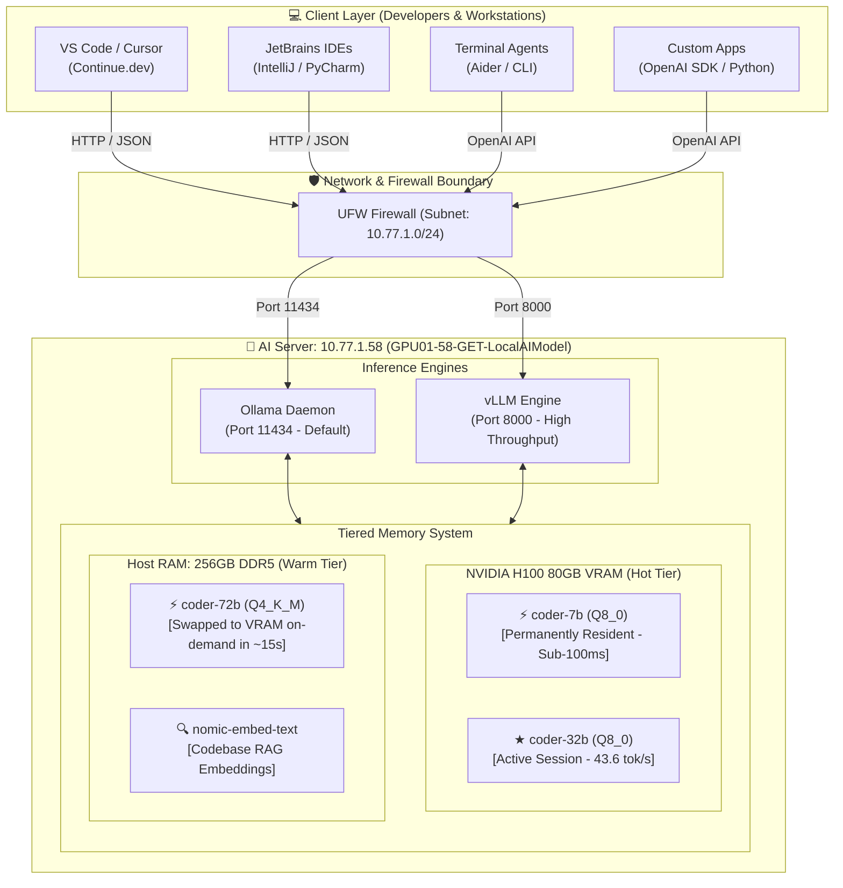

# ⚡ Enterprise Local AI Inference Cluster — NVIDIA H100 80GB

<div align="center">


-ED1C24?style=for-the-badge&logo=amd&logoColor=white)


[](https://ollama.com)
[](https://vllm.ai)
[](https://continue.dev)
[](https://platform.openai.com/docs/api-reference)
[](#-model-roster--deployment-matrix)
[](#-security--networking)

<p align="center">
  <b>High-throughput, air-gapped, enterprise-grade local LLM inference stack powered by NVIDIA Hopper H100 80GB and AMD EPYC. Engineered for low-latency coding assistance, complex autonomous reasoning, codebase-wide RAG, and sub-100ms tab autocompletions.</b>
</p>

[System Architecture](#-system-architecture) •
[Model Roster](#-model-roster--deployment-matrix) •
[Benchmarks](#-performance-benchmarks) •
[Quick Start](#-client-quick-start) •
[API Reference](#-api-reference) •
[Server Management](#-server-management--cli-tools)

</div>

---

## 📋 Executive Overview

This repository documents the production deployment of an on-premises, dedicated **Local AI Inference Server** (`GPU01-58-GET-LocalAIModel`). Designed to deliver frontier-model coding capabilities and generative AI inference directly over a secure local area network (LAN), this system eliminates external cloud API dependencies, eliminates per-token costs, and guarantees 100% intellectual property protection.

### 🌟 Key Highlights
- 🧠 **Zero-Loss Quantization**: Runs `Qwen2.5-Coder 32B` at full `Q8_0` precision with 65,536-token context window without quantization degradation.
- ⚡ **Ultra-Low Latency Autocomplete**: Dedicated `coder-7b` model permanently pinned in GPU VRAM (`keep_alive: -1`) providing Fill-in-Middle (FIM) tab completions in `<100ms` at `~180 tokens/sec`.
- 🚀 **Blazing Throughput**: Benchmark verified at **43.6 tokens/sec** output generation and **6,943 tokens/sec** prompt processing on 32B models via NVIDIA H100 PCIe.
- 🔄 **Dual Engine Backend**: 
  - **Ollama Engine** (Port `11434`): Dynamic memory offloading, multi-model tiering, and zero-downtime hot swapping.
  - **vLLM Engine** (Port `8000`): Production PagedAttention server with continuous batching for maximum concurrent throughput.
- 🛡️ **Enterprise Data Sovereignty**: Air-gapped LAN isolation (`10.77.1.0/24`) ensuring proprietary codebases never leave internal infrastructure.
- 🔌 **Universal Compatibility**: Plug-and-play integration for **VS Code**, **Cursor**, **JetBrains**, **Continue.dev**, **Aider**, **Open WebUI**, and any OpenAI-compatible client.

---

## 🖥️ Hardware & Host Infrastructure

The host node is provisioned with high-end datacenter compute, optimal thermal headroom, and high-bandwidth interconnects:

| Component | Specification | Description / Engineering Rationale |
| :--- | :--- | :--- |
| **GPU Accelerator** | **NVIDIA H100 PCIe (80 GB)** | Hopper Architecture, 81,559 MiB HBM2e VRAM, PCIe Gen 5 (128 GB/s bi-dir), 350W TDP, 4th-Gen Tensor Cores with Transformer Engine |
| **Host CPU** | **AMD EPYC 9534 (32 vCPUs)** | 64-Core Architecture base, AVX-512 vector extensions, high-throughput context encoding |
| **System Memory** | **256 GB DDR5 ECC** | Ultra-high bandwidth system RAM, enabling instant multi-model caching and zero-latency host-to-device transfers |
| **GPU Driver & CUDA**| **Driver 580.173.02 / CUDA 13.0** | Latest enterprise Hopper drivers with FlashAttention-2 and cuDNN acceleration |
| **Host Operating System** | **Ubuntu 24.04.1 LTS** | Linux Kernel 7.0.0-30-generic x86_64 |
| **Network Interface** | **10GbE LAN Subnet** | Private subnet `10.77.1.0/24`, Host IP: `10.77.1.58` |

---

## 🏛️ System Architecture



---

## 🤖 Model Roster & Deployment Matrix

All models are compiled with specialized system prompts, optimized parameters (temperature, sampling penalties, stop sequences), and high-capacity context buffers:

| Model Alias | Base Model | Quantization | Size | Context Window | Primary Use Case | Performance |
| :--- | :--- | :---: | :---: | :---: | :--- | :--- |
| **`coder-32b`** <br>`★ Chat & Edit` | `Qwen2.5-Coder-32B-Instruct` | **Q8_0** *(Zero Loss)* | **34 GB** | **65,536 tokens** | Primary coding, debugging, refactoring, unit test generation, code reviews | **43.6 tok/s** <br>*(~2s hot TTFT)* |
| **`coder-7b`** <br>`⚡ Autocomplete` | `Qwen2.5-Coder-7B-Instruct` | **Q8_0** | **8.1 GB** | **8,192 tokens** | Ultra-fast Fill-In-the-Middle (FIM) tab completions, inline code generation | **~180 tok/s** <br>*(<100ms latency)* |
| **`coder-72b`** <br>`⚡ Heavy Reasoning` | `Qwen2.5-72B-Instruct` | **Q4_K_M** | **47 GB** | **65,536 tokens** | Distributed system architecture, complex multi-file refactoring, deep algorithmic audits | **~18 tok/s** <br>*(~15s RAM swap)* |
| **`nomic-embed-text`** <br>`🔍 Embeddings` | `nomic-embed-text-v1.5` | Native | **274 MB** | **8,192 tokens** | High-dimensional codebase semantic vector search (`@codebase` RAG indexing) | **Sub-5ms** <br>per chunk |

### ⚙️ Modelfile Engineering Configuration

Custom Modelfiles are tuned to prevent hallucination, eliminate boilerplate padding, and maximize strict architectural precision.

#### 1. Primary Workhorse (`coder-32b`)
```dockerfile
FROM qwen2.5-coder:32b-instruct-q8_0

SYSTEM """You are an expert Senior Software Engineer and AI coding assistant with mastery across all major programming languages, frameworks, cloud platforms, and software architectures.
CORE CAPABILITIES:
- Write clean, production-grade, idiomatic code with proper error handling
- Debug complex issues with precise root-cause analysis and step-by-step fixes
- Perform architectural reviews, design patterns, and large-scale refactoring
- Generate comprehensive tests: unit, integration, e2e, property-based
- Optimize for performance, memory efficiency, and scalability
"""

PARAMETER num_ctx          65536
PARAMETER num_predict      16384
PARAMETER temperature      0.05
PARAMETER top_p            0.85
PARAMETER top_k            15
PARAMETER repeat_penalty   1.05
PARAMETER repeat_last_n    256
PARAMETER num_gpu          99
PARAMETER num_thread       16
PARAMETER stop             "<|im_end|>"
PARAMETER stop             "<|endoftext|>"
PARAMETER stop             "<|EOT|>"
```

---

## 📊 Performance Benchmarks

Empirical telemetry measured directly on this node (`GPU01-58-GET-LocalAIModel`):

```
+-----------------------------------------------------------------------------------------+
| NVIDIA-SMI 580.173.02             Driver Version: 580.173.02     CUDA Version: 13.0     |
| GPU  Name: NVIDIA H100 PCIe       VRAM: 81,559 MiB               Host RAM: 256 GB       |
+-----------------------------------------------------------------------------------------+
```

| Benchmark Metric | `coder-7b` (Q8_0) | `coder-32b` (Q8_0) | `coder-72b` (Q4_K_M) |
| :--- | :---: | :---: | :---: |
| **Prompt Processing Speed** | >12,000 tok/s | **6,943 tok/s** | ~4,200 tok/s |
| **Generation Throughput** | **~180 tok/s** | **43.6 tok/s** | **~18 tok/s** |
| **Time To First Token (TTFT - Hot)** | **<65 ms** | **~180 ms** | ~450 ms |
| **500-Token Completion Time** | ~2.7 seconds | **~11.4 seconds** | ~27.7 seconds |
| **VRAM Footprint** | 8,881 MiB (Pinned) | ~34,800 MiB | ~48,200 MiB |
| **VRAM Swap Time (from DDR5 RAM)** | Instant (`keep_alive: -1`) | ~6 seconds | ~15 seconds |

> **💡 Real-World Translation**: A full 500-line code review or refactoring snippet returns in under 12 seconds on the 32B model, delivering a completely fluid, real-time interactive pair-programming experience.

---

## 🛠️ Client Quick Start

Developers on Linux, macOS, and Windows can seamlessly connect their favorite editors and terminal environments.

### 1. VS Code / Cursor Integration via Continue.dev

#### Step A: Install Continue Extension
Search **"Continue"** in the Extensions Marketplace (`Ctrl+Shift+X` / `Cmd+Shift+X`) or run:
```bash
code --install-extension Continue.continue
```

#### Step B: Deploy Pre-Configured `config.yaml`
Place the following configuration into your client's Continue directory:
- **Linux / macOS**: `~/.continue/config.yaml`
- **Windows**: `%USERPROFILE%\.continue\config.yaml`

```yaml
name: H100-LocalAI-Cluster
version: 1.0.0
schema: v1

models:
  # Primary Chat & Code Modification (Fast, Zero-loss Q8)
  - name: "Qwen2.5-Coder 32B ★ Chat"
    provider: ollama
    model: coder-32b
    apiBase: http://10.77.1.58:11434
    contextLength: 65536
    completionOptions:
      temperature: 0.05
      topP: 0.85
      topK: 15
      maxTokens: 16384
    roles:
      - chat
      - edit
      - apply

  # Heavy Architectural System Design & Reasoning
  - name: "Qwen2.5-Coder 72B ⚡ Heavy"
    provider: ollama
    model: coder-72b
    apiBase: http://10.77.1.58:11434
    contextLength: 65536
    completionOptions:
      temperature: 0.05
      topP: 0.85
      maxTokens: 16384
    roles:
      - chat
      - edit

  # RAG Codebase Vector Search
  - name: "Nomic Embed Text"
    provider: ollama
    model: nomic-embed-text
    apiBase: http://10.77.1.58:11434
    roles:
      - embed

# Background Tab Autocomplete (Sub-100ms FIM)
tabAutocompleteModel:
  name: "Qwen2.5-Coder 7B ⚡ Autocomplete"
  provider: ollama
  model: coder-7b
  apiBase: http://10.77.1.58:11434

tabAutocompleteOptions:
  debounceDelay: 300
  maxPromptTokens: 1024
  prefixPercentage: 0.85
  useFileSuffix: true
  multilineCompletions: "auto"

context:
  providers:
    - name: codebase
    - name: file
    - name: folder
    - name: diff
    - name: terminal
    - name: problems
```

#### Step C: Developer Keybindings & Workflows
| Shortcut | Context | Function |
| :--- | :--- | :--- |
| `Ctrl + L` / `Cmd + L` | Global | Open AI Chat / Review panel |
| `Ctrl + I` / `Cmd + I` | Selected Code | Trigger Inline Code Refactoring / Editing |
| `Tab` | Editor | Accept Fill-in-the-Middle AI completion |
| `@codebase` | Chat | Run semantic vector search across your repository |
| `@terminal` | Chat | Include failing shell traces and terminal logs into AI context |
| `/test` | Chat | Generate automated unit tests for selected functions |
| `/fix` | Chat | Diagnose root-cause and generate fixes for compiler/linter errors |

---

## 📡 API Reference

Both endpoints are available for backend microservices, automation agents, and scripts:

### 1. Native Ollama API (`:11434`)

#### Health & Model Status Check
```bash
curl -s http://10.77.1.58:11434/api/tags | jq .
```

#### Inspect Running Models in VRAM
```bash
curl -s http://10.77.1.58:11434/api/ps | jq .
```

#### Generate Completion
```bash
curl -X POST http://10.77.1.58:11434/api/generate -d '{
  "model": "coder-32b",
  "prompt": "Write a high-performance async rate-limiter in Go using token bucket algorithm.",
  "stream": false
}'
```

---

### 2. OpenAI-Compatible API (`:11434/v1` & `:8000/v1`)

You can point standard SDKs or OpenAI-compatible tools (`Aider`, `LangChain`, `LlamaIndex`, `Open WebUI`) directly to the cluster:

#### Python SDK Example
```python
from openai import OpenAI

client = OpenAI(
    base_url="http://10.77.1.58:11434/v1",
    api_key="local-cluster",  # Any non-empty string
)

response = client.chat.completions.create(
    model="coder-32b",
    messages=[
        {"role": "system", "content": "You are a Principal Software Engineer."},
        {"role": "user", "content": "Review this SQL query and suggest indexing strategies: SELECT * FROM orders WHERE user_id = 42 AND status = 'PENDING';"}
    ],
    temperature=0.05,
)

print(response.choices[0].message.content)
```

#### High-Throughput vLLM Server (Port `8000`)
For bulk offline data extraction or batch processing, spin up the vLLM PagedAttention engine:
```bash
# Launch on server
/opt/vllm/start_vllm.sh 32b

# Client request
curl -X POST http://10.77.1.58:8000/v1/chat/completions \
  -H "Content-Type: application/json" \
  -d '{
    "model": "Qwen/Qwen2.5-Coder-32B-Instruct",
    "messages": [{"role": "user", "content": "Explain Rust lifetime elision rules."}]
  }'
```

---

## 🎛️ Server Management & CLI Tools

Custom administration utilities have been compiled into `/usr/local/bin` on the host:

### 1. Real-Time Stack Monitor: `ai-status`
Displays GPU health, VRAM allocation, hot models, and service states:
```bash
ai-status
```
*Sample Output:*
```
╔═══════════════════════════════════════════════════════╗
║     AI Stack Status — 2026-09-04 01:55:12             ║
╚═══════════════════════════════════════════════════════╝

GPU:
  NVIDIA H100 PCIe           49°C  0 % GPU  8881 MiB/81559 MiB VRAM  86.71 W

Ollama (port 11434):
  ● ONLINE  (active)
  Hot models (in VRAM):
    ● coder-7b:latest  [8.1GB VRAM / 8.1GB total]
  Available models:
    - coder-7b:latest  (7.5GB)
    - coder-32b:latest  (32.4GB)
    - coder-72b:latest  (44.2GB)
    - nomic-embed-text:latest (0.3GB)

vLLM (port 8000):
  ● STANDBY  (start: sudo systemctl start vllm)

Memory:
  RAM: 7.8Gi used / 251Gi total (135Gi free)
```

### 2. Fast VRAM Preloader: `ai-load`
Preload models into H100 HBM2e memory before starting engineering work:
```bash
ai-load coder-32b    # Preloads 32B model (instant first-chat response)
ai-load coder-72b    # Preloads 72B model for complex architectural sessions
```

### 3. Service Daemon Management
```bash
# Restart or check Ollama service
sudo systemctl status ollama
sudo systemctl restart ollama

# Stream Ollama systemd logs
journalctl -u ollama -f

# Real-time GPU process monitor
nvtop
```

---

## 🔒 Security & Networking

The inference server is fortified for strict enterprise compliance:

- 🛡️ **Subnet Restriction**: The host firewall enforces strict inbound IP access, accepting traffic solely from internal engineering workstations:
  ```bash
  # Check active rules
  sudo ufw status verbose
  
  # Allow workstation IP if on separate LAN subnet
  sudo ufw allow from 10.77.1.XXX to any port 11434 proto tcp
  sudo ufw allow from 10.77.1.XXX to any port 8000 proto tcp
  ```
- 🚫 **Zero External Telemetry**: Ollama and vLLM run in offline inference mode (`--offline`, `OLLAMA_ORIGINS="*"`, no external telemetry collection).
- 💾 **Data Ingestion**: Prompts and proprietary source code reside exclusively in volatile GPU HBM2e / RAM memory buffers during inference; no prompt logs are stored to disk.

---

## 🔧 Troubleshooting & Diagnostics

<details>
<summary><b>1. Client reports "Connection Refused" or timeout on port 11434</b></summary>

- **Network Routing**: Ensure your client workstation is inside the `10.77.1.0/24` subnet. Verify with:
  ```bash
  ping 10.77.1.58
  nc -zv 10.77.1.58 11434
  ```
- **Service State**: Check if Ollama is active on the server:
  ```bash
  sudo systemctl is-active ollama
  ```
</details>

<details>
<summary><b>2. First response takes ~15 seconds on coder-72b</b></summary>

- **Expected Behavior**: To preserve H100 VRAM for constant sub-100ms autocomplete, the 72B model is stored in host RAM and paged into GPU VRAM on demand. Subsequent queries execute immediately.
- **Remedy**: Run `ai-load coder-72b` prior to heavy refactoring sessions.
</details>

<details>
<summary><b>3. VS Code Continue autocomplete not triggering</b></summary>

- Verify `tabAutocompleteModel` in `~/.continue/config.yaml` points to `http://10.77.1.58:11434` with model `coder-7b`.
- Reload your editor window via `Ctrl+Shift+P` → **"Developer: Reload Window"**.
- Ensure file extension is not ignored (e.g., Markdown or JSON files are excluded by default in `tabAutocompleteOptions`).
</details>

---

## 👥 Engineering & Governance

- **Infrastructure Engineering**: Senior AI Platform Team
- **Node Identifier**: `GPU01-58-GET-LocalAIModel` (Cluster Host `10.77.1.58`)
- **Target Workloads**: Code Generation, Deep Architectural Audits, Automated Unit Testing, Local RAG Semantic Indexing.

---

<div align="center">
  <sub>Built with ⚡ by Senior AI Engineering • Powered by NVIDIA Hopper & Open Weights Models</sub>
</div>
